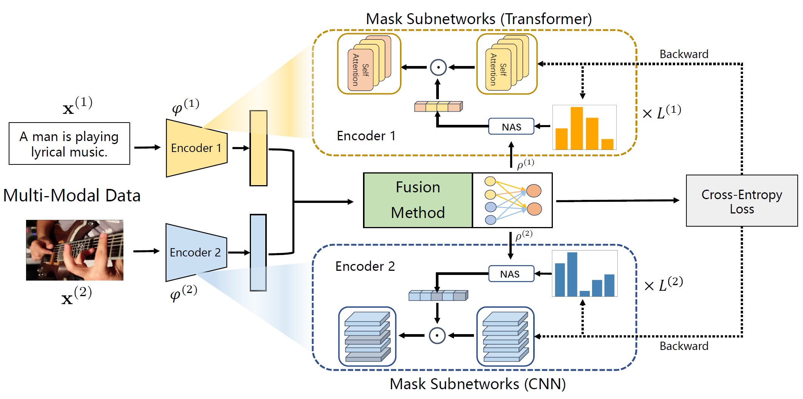

# Released Code for Paper " Learning to Rebalance Multi-Modal Optimization by Adaptively Masking Subnetworks"


<p align="center">

</p>

- Authors: Yang Yang, Hongpeng Pan, Qing-Yuan Jiang, Yi Xu, and Jinhui Tang 
- Contact: yyang@njust.edu.cn
- [Paper Link](Learning to Rebalance Multi-Modal Optimization by Adaptively Masking Subnetworks)

## 1.Introduction

Here is the official PyTorch implementation of AMSS proposed in "Learning to Rebalance Multi-Modal Optimization by Adaptively Masking Subnetworks".

We propose a novel importance sampling-based, element-wise joint optimization method, called Adaptively Mask Subnetworks Considering Modal Significance (AMSS). Specifically, we incorporate mutual information rates to determine the modal significance and employ non-uniform adaptive sampling to select foreground subnetworks from each modality for parameter updates, thereby rebalancing multi-modal learning. Additionally, we demonstrate the reliability of the AMSS strategy through convergence analysis. Building upon theoretical insights, we further enhance the multi-modal mask subnetwork strategy using unbiased estimation, referred to as AMSS+. Extensive experiments reveal the superiority of our approach over comparison methods.

## 2.Usage

### 2.1 Environment

Please refer to env.yml file

### 2.2 Pretrained Model Preparation

If you want to run the method on a text-image dataset such as Sarcasm. Please download the pretrained text and image encoder and place it to the corresponding path.

Text encoder : [bert-base-uncased]([google-bert/bert-base-uncased at main (huggingface.co)](https://huggingface.co/google-bert/bert-base-uncased/tree/main))

Image encoder : [Resnet50](https://download.pytorch.org/models/resnet50-0676ba61.pth) from torchvision

For NVGesture dataset, please down load the rgb_imagenet.pt and flow_imagenet.pt form this [link](https://github.com/piergiaj/pytorch-i3d/tree/master/models)

### 2.3 Data Preparation

You can download the corresponding raw data from the link below and prepare the data according the instructions of the cited paper. 

Original Dataset : [CREMA-D](https://github.com/CheyneyComputerScience/CREMA-D), [Kinetics-Sounds](https://github.com/cvdfoundation/kinetics-dataset), [Sarcasm](https://github.com/feiLinX/Multi-modal-Sarcasm-Detection), [Twitter15](https://github.com/jefferyYu/TomBERT), [NVGesture](https://research.nvidia.com/publication/2016-06_online-detection-and-classification-dynamic-hand-gestures-recurrent-3d)

The directory organization of the final data file should be as follows.

```
data_root/
│
├── CREMAD/
│   ├── annotations/
│	│	├── train.csv
│	│	├── valid.csv
│   │	└── test.csv
│   ├── AudioWAV/
│  	│   ├── 1001_DFA_ANG_XX.wav
│  	│   ├── ...
│   │   └── 1091_WSI_SAD_XX.wav
│   └── Image-01-FPS/
│		├── 1001_DFA_ANG_XX/
│		│	└──xxxx,jpg
│		└── ...
│			
├── kinetics_sound/
│   ├── annotations/
│	│	├── train.csv
│	│	├── valid.csv
│   │	└── test.csv
│   ├── train_wav/
│  	│   ├── __Ezu3Z_N9U-000002——000012.wav
│  	│   └── ...
│   │    
│   ├── train_img/Image-01-FPS/
│	│	├── __Ezu3Z_N9U-000002——000012/
│	│	│	└──xxxx,jpg
│	│	└── ...
│	├── test_wav/	
│	│	└── ...
│  	└── test_img/
│		└── ...
│
├── NVGesture/
│	├── nvgesture_train_correct_v2.lst
│	├── nvgesture_valid_correct_v2.lst
│   ├── nvgesture_test_correct_v2.lst
│	└── Video_data/
│		├── class_01/
│		│	├── subject1_r0/
│		│	│	├── xxx.txt
│		│	│	└── xxx.avi
│		│	└── ...
│		└── ...
│
├── sarcasm/
│   ├── annotations/
│	│	├── train_data.csv
│	│	├── valid_data.csv
│   │	└── test_data.csv
│   └── images/
│  		├── xxxx.jpg
│  		└── ...
│       
└── Twitter15/
 	├── annotations/
	│	├── train_data.tsv
	│	├── valid_data.tsv
   	│	└── test_data.tsv
   	└── twitter2015_images/
  	    ├── xxxx.jpg
  	    └── ...

```

### 2.4 Training & Test

#### AMSS for Kinetics-Sound

```bash
python train_test.py --gpu_id=0 --single_pretrain=0 --mask_resnet=1 --mask_ffn=1 --isbias=0 --optimizer=SGD --sample_mode=Adaptive --bias=0 --our_model=balance --patience=60 --epoch=80 --dataset=KS --lr=0.01
```

#### AMSS+ for Kinetics-Sound

```bash
python train_test.py --gpu_id=0 --single_pretrain=0 --mask_resnet=1 --mask_ffn=1 --isbias=1 --dataset=KS --optimizer=SGD --sample_mode=Adaptive --bias=0 --our_model=balance --patience=60 --epoch=80 --lr=0.01
```

#### AMSS for CREMA-D

```bash
python train_test.py --gpu_id=0 --single_pretrain=0 --mask_resnet=1 --mask_ffn=1 --isbias=0 --data_path='/media/php/data/CREMA' --sample_mode=Adaptive --our_model=normal --patience=60 --epoch=80 --lr=0.01 --dataset=CREMA --optimizer='SGD'
```

#### AMSS+ for CREMA-D

```bash
python train_test.py --gpu_id=0 --single_pretrain=0 --mask_resnet=1 --mask_ffn=1 --isbias=1 --data_path='/media/php/data/CREMA' --sample_mode=Adaptive --our_model=normal --patience=60 --epoch=80 --lr=0.01 --dataset=CREMA --optimizer='SGD'
```

#### AMSS for Sarcasm

```bash
python -W ignore train_test_IT.py --dataset=Sarcasm --batch_size=32 --test_batch_size=32 --fusion_method=concat --gpu_id=0 --mask_resnet=1 --mask_ffn=1 --isbias=0 --temperature=0.5 --sample_mode=Adaptive --optimizer=Adam --lr=0.000002 --bias=0.2 --gn_mode=gn --patience=40 --epoch=50 --our_model=Adaptive
```

#### AMSS+ for Sarcasm

```bash
python -W ignore train_test_IT.py --dataset=Sarcasm --batch_size=32 --test_batch_size=32 --fusion_method=concat --gpu_id=0 --mask_resnet=1 --mask_ffn=1 --isbias=1 --temperature=0.5 --sample_mode=Adaptive --optimizer=Adam --lr=0.000002 --bias=0.2 --gn_mode=gn --patience=40 --epoch=50--our_model=Adaptive
```

#### AMSS for Twitter15

```bash
python -W ignore train_test_IT.py --dataset=Twitter15 --batch_size=16 --test_batch_size=32 --fusion_method=concat --gpu_id=0 --mask_resnet=1 --mask_ffn=1 --isbias=0 --temperature=0.5 --sample_mode=Adaptive --optimizer=Adam --lr=0.000002 --bias=0.2 --gn_mode=gn --patience=40 --epoch=50 --our_model=Adaptive
```

#### AMSS for Twitter15

```bash
python -W ignore train_test_IT.py --dataset=Sarcasm --batch_size=32 --test_batch_size=32 --fusion_method=concat --gpu_id=0 --mask_resnet=1 --mask_ffn=1 --isbias=1 --temperature=0.5 --sample_mode=Adaptive --optimizer=Adam --lr=0.000002 --bias=0.2 --gn_mode=gn --patience=40 --epoch=50--our_model=Adaptive
```

####AMSS for NVGesture

```bash
python -W ignore train_nv.py --lr=0.01 --epoch=100 --single_pretrain=0 --patience=80 --our_model='meta' --batch-size=4 --mask_resnet=1 --mask_ffn=1 --isbias=0
```

#### AMSS+ for NVGesture

```bash
python -W ignore train_nv.py --lr=0.01 --epoch=100 --single_pretrain=0 --patience=80 --our_model='meta' --batch-size=4 --mask_resnet=1 --mask_ffn=1 --isbias=1
```

## 3.Citation

```
@article{AMSS:journals/pami/YangPJXT25,
  author       = {Yang Yang and
                  Hongpeng Pan and
                  Qing{-}Yuan Jiang and
                  Yi Xu and
                  Jinghui Tang},
  title        = {Learning to Rebalance Multi-Modal Optimization by Adaptively Masking
                  Subnetworks},
  journal      = {IEEE Transactions on Pattern Analysis and Machine Intelligence},
  year         = {2025}
}
```

